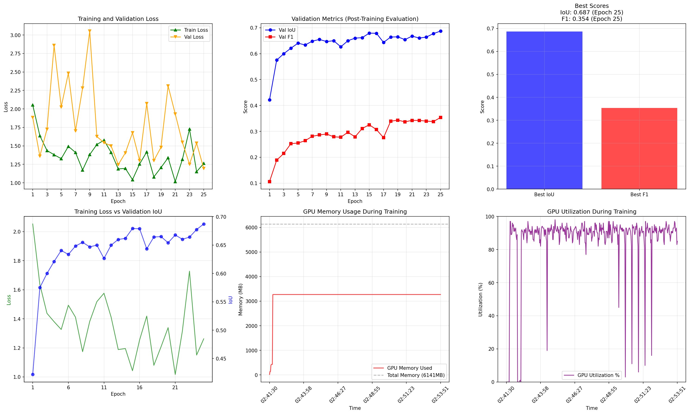
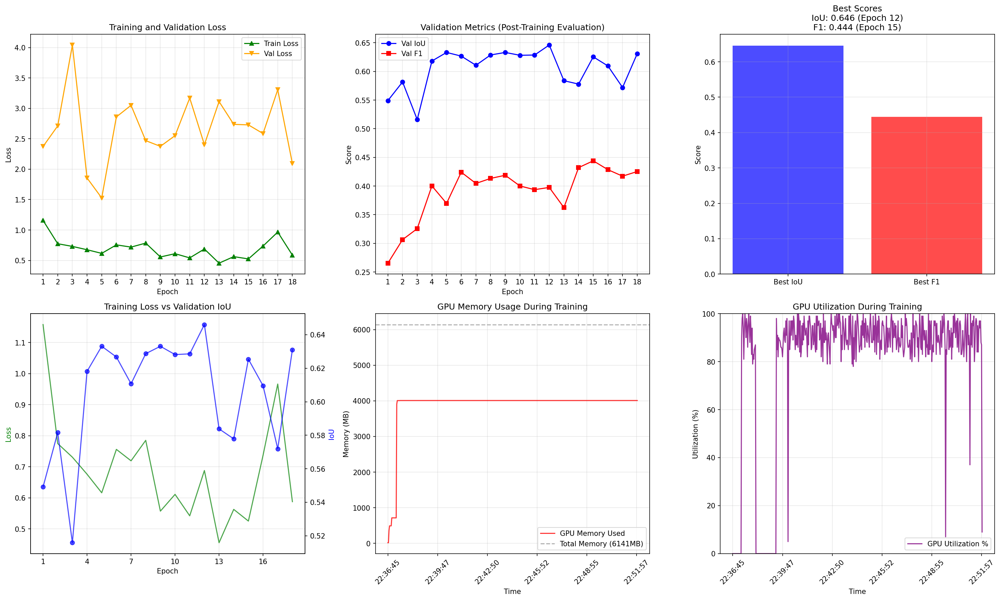
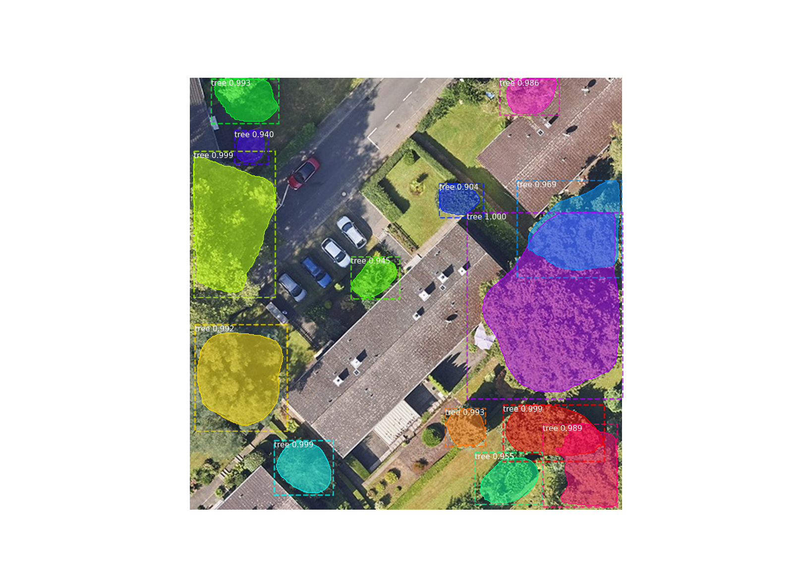
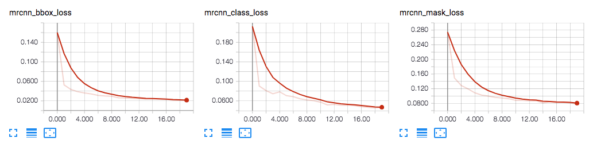
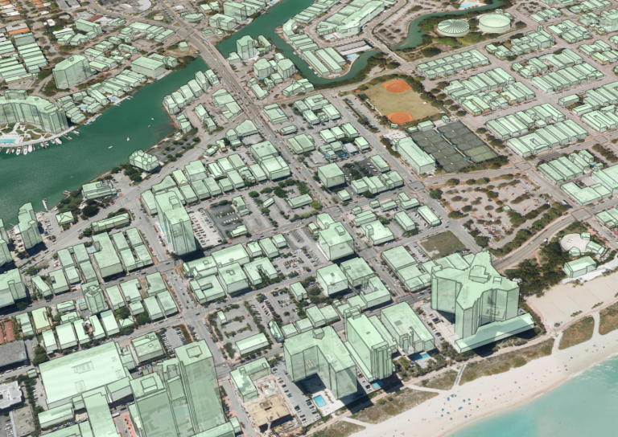
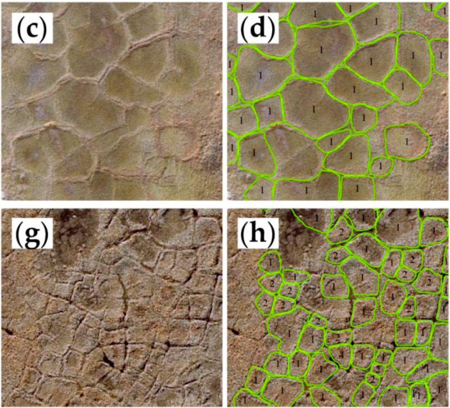

# Shadow Casting Object Segmentation 🌑🖼️

## Overview 🎯

This repository contains code and datasets related to shadow casting object segmentation. The project focuses on detecting and segmenting objects in images affected by shadows, a challenging task in computer vision due to the complex interaction between objects and shadow patterns.

The dataset included follows the YOLO format for object detection training. The segmentation approach aims to improve accuracy in scenarios with significant shadow effects.

## Features ✨

- 📂 Dataset prepared in YOLO format for shadow-affected object segmentation.
- 🛠️ Scripts and models for training and inference.
- 🔧 Tools for preprocessing and annotation support.

## Authors ✍️

- [Sai Mukkundan](mailto:sai.ramamoorthy@smail.inf.h-brs.de) – [📧 Email](mailto:sai.ramamoorthy@smail.inf.h-brs.de)
- [Shrikar Nakhye](https://www.linkedin.com/in/shrikar-n-053262188/) – [📧 Email](mailto:shrikar.nakhye@smail.inf.h-brs.de)

####  Aerial Segmentation Using U-Net: Please refer the [Prithvi Vision Repo](https://github.com/ItsShriks/PrithviVision)

# Aerial Segmentation with Mask R-CNN

This project provides an implementation of Mask R-CNN for instance segmentation of trees in aerial imagery. It is built upon the Matterport Mask R-CNN implementation and includes scripts for training, evaluation, and visualization.

## Environment Setup

### 1. Create Conda Environment

Create a conda environment with the required dependencies using the provided environment file:

```bash
conda env create -f ../Essentials/maskrcnn_gpu.yml
```

### 2. Activate Environment

```bash
conda activate maskrcnn_gpu
```

### 3. Install Matterport Mask R-CNN

Follow the official Matterport Mask R-CNN setup process:

```bash
# Install the mrcnn package
cd mrcnn_lib
python3 setup.py install

# Download pre-trained COCO weights (required for transfer learning)
wget https://github.com/matterport/Mask_RCNN/releases/download/v2.0/mask_rcnn_coco.h5
```

**Note**: Ensure you have CUDA-compatible GPU drivers installed for optimal performance with the nvidia-tensorflow package.

## Scripts

### 1. `aerial_segmentation.py`

The main production script for training and testing Mask R-CNN models on aerial tree imagery. This enhanced implementation includes advanced memory management, comprehensive logging, and post-training evaluation features.

**Key Features:**
- **Post-Training Evaluation**: Validates all saved epochs after training to conserve GPU memory
- **Advanced Logging**: Separates stdout/stderr into `training.log` and `training_error.log`
- **GPU Monitoring**: Real-time GPU memory usage tracking with CSV output
- **Signal Handlers**: Graceful cleanup on interruption to prevent GPU memory leaks
- **Optimized Config**: Tuned hyperparameters for aerial tree segmentation

**Training Command:**
```bash
python3 samples/aerial_segmentation.py --command train --dataset /path/to/yolo_dataset --weights coco --logs /path/to/logs
```

**Inference Command:**
```bash
python3 samples/aerial_segmentation.py --command test --dataset /path/to/yolo_dataset --weights /path/to/trained_weights.h5 --image /path/to/test_image.jpg
```

### 2. `eval_ap.py`

Evaluation script that computes Average Precision (AP) metrics on dataset subsets using trained models. Provides detailed per-image analysis and supports overlay visualization.

**Key Features:**
- **AP Computation**: Uses COCO-style evaluation metrics with configurable IoU thresholds
- **CSV Output**: Detailed per-image results with ground truth vs prediction counts
- **Overlay Generation**: Optional visualization of predictions vs ground truth
- **Batch Processing**: Efficient evaluation on validation/test sets

**Evaluation Command:**
```bash
python3 samples/eval_ap.py --dataset /path/to/yolo_dataset --subset valid --weights /path/to/weights.h5 --output results.csv --iou 0.5
```

**With Overlays:**
```bash
python3 samples/eval_ap.py --dataset /path/to/yolo_dataset --weights /path/to/weights.h5 --save_overlays /path/to/output_dir --limit 50
```

### 3. `tree_segmentation.py`

Simplified baseline script that provides basic training and inference functionality. This script served as the foundation for the enhanced `aerial_segmentation.py` implementation.

**Key Features:**
- **Simple Interface**: Basic train/test commands without advanced features
- **GPU Memory Limiting**: Optional 4GB GPU memory constraint
- **Overlay Generation**: Basic prediction visualization with contours
- **Configuration Display**: Shows active model parameters during execution

**Training Command:**
```bash
python3 samples/tree_segmentation.py --command train --dataset /path/to/yolo_dataset --weights coco --epochs 30
```

**Inference Command:**
```bash
python3 samples/tree_segmentation.py --command test --image /path/to/image.jpg --weights /path/to/weights.h5 --save_overlay --output /path/to/output.jpg
```

## Results

The model was trained on a custom dataset of aerial images with YOLO-style polygon annotations using two different backbone architectures. The training produced comprehensive metrics showing the model's learning progress over time.

### ResNet-50 Backbone (Recommended)



**Performance Summary:**
- **Validation IoU**: 0.687
- **Validation F1-Score**: 0.354  
- **GPU Memory Usage**: 3.27 GB
- **Training Time**: 29.5 seconds/epoch
- **Final Training Loss**: 1.26

### ResNet-101 Backbone (Higher Accuracy)



**Performance Summary:**
- **Higher model capacity** with deeper backbone architecture
- **Increased GPU memory requirements** (~5.2 GB)
- **Longer training time** but potentially better feature extraction
- **Suitable for high-end GPUs** with sufficient memory

### Inference Results



The above images demonstrate the model's inference capabilities on aerial tree imagery, showing detected instances with segmentation masks and bounding boxes. Both backbone architectures provide robust tree detection and segmentation performance, with ResNet-50 offering better computational efficiency and ResNet-101 providing higher model accuracy and classification.

## Getting Started

### Dataset Preparation

Ensure your dataset follows the YOLO format structure:
```
dataset/
├── train/
│   ├── images/
│   └── labels/
└── valid/
    ├── images/
    └── labels/
```

**Important Note on Dataset Processing:**

The Mask R-CNN scripts (`aerial_segmentation.py` and `tree_segmentation.py`) include built-in preprocessing that automatically converts YOLO-format polygon annotations to Mask R-CNN format during runtime. This conversion process:

- Reads YOLO-style `.txt` label files with normalized polygon coordinates
- Converts polygon coordinates to pixel coordinates based on image dimensions
- Generates binary masks for each object instance using `cv2.fillPoly()`
- Creates the required mask arrays and class IDs for Mask R-CNN training

**Key Differences from U-Net:**
- **U-Net**: Requires pre-processed masks saved as separate image files
- **Mask R-CNN**: Processes YOLO annotations on-the-fly during training/inference
- **Storage**: No intermediate mask files are saved to disk, reducing storage requirements
- **Flexibility**: Supports multiple instances per image with individual masks per object

This runtime conversion approach allows for efficient memory usage and eliminates the need to store large mask files, unlike the U-Net implementation which requires pre-generated mask images.

### Training

#### 1. Basic Training (Recommended)

Start training with pre-trained COCO weights:

```bash
python3 samples/aerial_segmentation.py --command train --dataset /path/to/yolo_dataset --weights coco
```

#### 2. Training with Custom Options

```bash
python3 samples/aerial_segmentation.py --command train \
    --dataset /path/to/yolo_dataset \
    --weights coco \
    --logs /custom/logs/directory \
    --epochs 25
```

#### 3. Resume Training from Checkpoint

```bash
python3 samples/aerial_segmentation.py --command train \
    --dataset /path/to/yolo_dataset \
    --weights /path/to/checkpoint.h5 \
    --logs /logs/directory
```

**Training Options:**
- `--dataset`: Path to YOLO-format dataset directory (required)
- `--weights`: Pre-trained weights - use `coco` for COCO weights or path to `.h5` file
- `--logs`: Directory to save training logs and model checkpoints (default: `../logs`)
- `--epochs`: Number of training epochs (default: 25)
- `--layers`: Layers to train - `heads` (default) or `all`

**Training Features:**
- **Automatic GPU Memory Management**: Optimized memory allocation to prevent OOM errors
- **Progressive Evaluation**: Post-training validation on all saved epochs
- **Comprehensive Logging**: Separate log files for training and error messages
- **Real-time Monitoring**: GPU memory usage tracking throughout training
- **Signal Handling**: Safe cleanup on interruption (Ctrl+C)

### Inference

#### 1. Single Image Inference

```bash
python3 samples/aerial_segmentation.py --command test \
    --weights /path/to/trained_model.h5 \
    --image /path/to/test_image.jpg
```

#### 2. Batch Inference with Custom Settings

```bash
python3 samples/aerial_segmentation.py --command test \
    --weights /path/to/trained_model.h5 \
    --image /path/to/test_image.jpg \
    --min_confidence 0.7 \
    --save_overlay \
    --output /path/to/output_directory
```

**Inference Options:**
- `--weights`: Path to trained model weights (`.h5` file) (required)
- `--image`: Path to input image for inference (required for test mode)
- `--min_confidence`: Detection confidence threshold (default: 0.8)
- `--save_overlay`: Save visualization with detected masks
- `--output`: Custom output path for results

### Evaluation

#### 1. Standard Evaluation

Compute Average Precision (AP) on validation set:

```bash
python3 samples/eval_ap.py --dataset /path/to/yolo_dataset \
    --subset valid \
    --weights /path/to/trained_model.h5 \
    --output evaluation_results.csv
```

#### 2. Detailed Evaluation with Visualizations

```bash
python3 samples/eval_ap.py --dataset /path/to/yolo_dataset \
    --subset valid \
    --weights /path/to/trained_model.h5 \
    --output detailed_results.csv \
    --save_overlays /path/to/overlay_output \
    --iou 0.5 \
    --limit 100 \
    --min_confidence 0.7
```

**Evaluation Options:**
- `--dataset`: Path to YOLO-format dataset (required)
- `--subset`: Dataset subset to evaluate - `train` or `valid` (default: `valid`)
- `--weights`: Path to trained model weights (required)
- `--output`: CSV file for detailed results (default: `eval_results.csv`)
- `--save_overlays`: Directory to save prediction overlay images
- `--iou`: IoU threshold for AP calculation (default: 0.5)
- `--limit`: Maximum number of images to evaluate
- `--min_confidence`: Override model's detection confidence threshold
- `--logs`: Custom logs directory (default: `../logs`)

**Evaluation Outputs:**
- **CSV Results**: Per-image metrics including ground truth count, predictions, and AP scores
- **Overlay Images**: Visual comparison of predictions vs ground truth (if `--save_overlays` specified)
- **Summary Statistics**: Mean AP across all evaluated images

### Alternative Baseline Script

For simpler training without advanced features, use the baseline script:

```bash
# Training
python3 samples/tree_segmentation.py --command train \
    --dataset /path/to/yolo_dataset \
    --weights coco \
    --layers heads

# Inference with overlay
python3 samples/tree_segmentation.py --command test \
    --image /path/to/image.jpg \
    --weights /path/to/model.h5 \
    --save_overlay \
    --output /path/to/result.jpg
```

---

# Matterport's Mask R-CNN for Object Detection and Segmentation

This is an implementation of [Mask R-CNN](https://arxiv.org/abs/1703.06870) on Python 3, Keras, and TensorFlow. The model generates bounding boxes and segmentation masks for each instance of an object in the image. It's based on Feature Pyramid Network (FPN) and a ResNet101 backbone.


The repository includes:
* Source code of Mask R-CNN built on FPN and ResNet101.
* Training code for MS COCO
* Pre-trained weights for MS COCO
* Jupyter notebooks to visualize the detection pipeline at every step
* ParallelModel class for multi-GPU training
* Evaluation on MS COCO metrics (AP)
* Example of training on your own dataset


The code is documented and designed to be easy to extend. If you use it in your research, please consider citing this repository (bibtex below). If you work on 3D vision, you might find our recently released [Matterport3D](https://matterport.com/blog/2017/09/20/announcing-matterport3d-research-dataset/) dataset useful as well.
This dataset was created from 3D-reconstructed spaces captured by our customers who agreed to make them publicly available for academic use. You can see more examples [here](https://matterport.com/gallery/).

# Getting Started
## 6. Logging to TensorBoard
TensorBoard is another great debugging and visualization tool. The model is configured to log losses and save weights at the end of every epoch.



## 6. Composing the different pieces into a final result


# Training on MS COCO
We're providing pre-trained weights for MS COCO to make it easier to start. You can
use those weights as a starting point to train your own variation on the network.
Training and evaluation code is in `samples/coco/coco.py`. You can import this
module in Jupyter notebook (see the provided notebooks for examples) or you
can run it directly from the command line as such:

```
# Train a new model starting from pre-trained COCO weights
python3 samples/coco/coco.py train --dataset=/path/to/coco/ --model=coco

# Train a new model starting from ImageNet weights
python3 samples/coco/coco.py train --dataset=/path/to/coco/ --model=imagenet

# Continue training a model that you had trained earlier
python3 samples/coco/coco.py train --dataset=/path/to/coco/ --model=/path/to/weights.h5

# Continue training the last model you trained. This will find
# the last trained weights in the model directory.
python3 samples/coco/coco.py train --dataset=/path/to/coco/ --model=last
```

You can also run the COCO evaluation code with:
```
# Run COCO evaluation on the last trained model
python3 samples/coco/coco.py evaluate --dataset=/path/to/coco/ --model=last
```

The training schedule, learning rate, and other parameters should be set in `samples/coco/coco.py`.


# Training on Your Own Dataset

Start by reading this [blog post about the balloon color splash sample](https://engineering.matterport.com/splash-of-color-instance-segmentation-with-mask-r-cnn-and-tensorflow-7c761e238b46). It covers the process starting from annotating images to training to using the results in a sample application.

In summary, to train the model on your own dataset you'll need to extend two classes:

```Config```
This class contains the default configuration. Subclass it and modify the attributes you need to change.

```Dataset```
This class provides a consistent way to work with any dataset. 
It allows you to use new datasets for training without having to change 
the code of the model. It also supports loading multiple datasets at the
same time, which is useful if the objects you want to detect are not 
all available in one dataset. 

See examples in `samples/shapes/train_shapes.ipynb`, `samples/coco/coco.py`, `samples/balloon/balloon.py`, and `samples/nucleus/nucleus.py`.

## Differences from the Official Paper
This implementation follows the Mask RCNN paper for the most part, but there are a few cases where we deviated in favor of code simplicity and generalization. These are some of the differences we're aware of. If you encounter other differences, please do let us know.

* **Image Resizing:** To support training multiple images per batch we resize all images to the same size. For example, 1024x1024px on MS COCO. We preserve the aspect ratio, so if an image is not square we pad it with zeros. In the paper the resizing is done such that the smallest side is 800px and the largest is trimmed at 1000px.
* **Bounding Boxes**: Some datasets provide bounding boxes and some provide masks only. To support training on multiple datasets we opted to ignore the bounding boxes that come with the dataset and generate them on the fly instead. We pick the smallest box that encapsulates all the pixels of the mask as the bounding box. This simplifies the implementation and also makes it easy to apply image augmentations that would otherwise be harder to apply to bounding boxes, such as image rotation.

    To validate this approach, we compared our computed bounding boxes to those provided by the COCO dataset.
We found that ~2% of bounding boxes differed by 1px or more, ~0.05% differed by 5px or more, 
and only 0.01% differed by 10px or more.

* **Learning Rate:** The paper uses a learning rate of 0.02, but we found that to be
too high, and often causes the weights to explode, especially when using a small batch
size. It might be related to differences between how Caffe and TensorFlow compute 
gradients (sum vs mean across batches and GPUs). Or, maybe the official model uses gradient
clipping to avoid this issue. We do use gradient clipping, but don't set it too aggressively.
We found that smaller learning rates converge faster anyway so we go with that.

## Citation
Use this bibtex to cite this repository:
```
@misc{matterport_maskrcnn_2017,
  title={Mask R-CNN for object detection and instance segmentation on Keras and TensorFlow},
  author={Waleed Abdulla},
  year={2017},
  publisher={Github},
  journal={GitHub repository},
  howpublished={\url{https://github.com/matterport/Mask_RCNN}},
}
```

## Requirements
Python 3.4, TensorFlow 1.3, Keras 2.0.8 and other common packages listed in `requirements.txt`.

### MS COCO Requirements:
To train or test on MS COCO, you'll also need:
* pycocotools (see the instructions under the Installation section for details)
* MS COCO Dataset > http://cocodataset.org

## Installation
1. Clone this repository
2. Install dependencies
   ```bash
   pip3 install -r requirements.txt
   ```
3. Run setup from the repository root directory
   ```bash
   python3 setup.py install
   ```
4. Download pre-trained COCO weights (mask_rcnn_coco.h5) from the [releases page](https://github.com/matterport/Mask_RCNN/releases).
5. (Optional) To train or test on MS COCO install `pycocotools` from one of these repos. They are forks of the original pycocotools with fixes for Python3 and Windows (the official repo doesn't seem to be active anymore).

   * Linux: https://github.com/waleedka/coco
   * Windows: https://github.com/philferriere/cocoapi.
   You must have the Visual C++ 2015 build tools on your path (see the repo for additional details)

## Contributing
Contributions to this repository are welcome. Examples of things you can contribute:
* Speed Improvements. Like re-writing some Python code in Cython.
* Training on other datasets.
* Accuracy Improvements.
* Visualizations and examples.

You can also join the Matterport community and contribute to the Matterport3D dataset.


**Training the model:**

```bash
python3 samples/aerial_segmentation.py train --dataset /path/to/yolo_dataset --weights coco
```

### 2. `eval_ap.py`

This script is used to evaluate the model's performance by computing the Average Precision (AP) on a dataset subset.

**Evaluating the model:**

```bash
python3 samples/eval_ap.py --dataset /path/to/yolo_dataset --subset valid --weights /path/to/weights.h5
```

### 3. `tree_segmentation.py`

This script provides an alternative and simplified training and inference pipeline, which served as the baseline for this project.

## Results

The model was trained on a custom dataset of aerial images with YOLO-style polygon annotations. The training produced the following metrics, which show the model's learning progress over time.


The above chart displays the training and validation losses, as well as the F1-score and IoU, providing a comprehensive view of the model's performance.

---

# Mask R-CNN for Object Detection and Segmentation

This is an implementation of [Mask R-CNN](https://arxiv.org/abs/1703.06870) on Python 3, Keras, and TensorFlow. The model generates bounding boxes and segmentation masks for each instance of an object in the image. It's based on Feature Pyramid Network (FPN) and a ResNet101 backbone.


The repository includes:
* Source code of Mask R-CNN built on FPN and ResNet101.
* Training code for MS COCO
* Pre-trained weights for MS COCO
* Jupyter notebooks to visualize the detection pipeline at every step
* ParallelModel class for multi-GPU training
* Evaluation on MS COCO metrics (AP)
* Example of training on your own dataset


The code is documented and designed to be easy to extend. If you use it in your research, please consider citing this repository (bibtex below). If you work on 3D vision, you might find our recently released [Matterport3D](https://matterport.com/blog/2017/09/20/announcing-matterport3d-research-dataset/) dataset useful as well.
This dataset was created from 3D-reconstructed spaces captured by our customers who agreed to make them publicly available for academic use. You can see more examples [here](https://matterport.com/gallery/).

# Getting Started
## 6. Logging to TensorBoard
TensorBoard is another great debugging and visualization tool. The model is configured to log losses and save weights at the end of every epoch.


## 6. Composing the different pieces into a final result


# Training on MS COCO
We're providing pre-trained weights for MS COCO to make it easier to start. You can
use those weights as a starting point to train your own variation on the network.
Training and evaluation code is in `samples/coco/coco.py`. You can import this
module in Jupyter notebook (see the provided notebooks for examples) or you
can run it directly from the command line as such:

```
# Train a new model starting from pre-trained COCO weights
python3 samples/coco/coco.py train --dataset=/path/to/coco/ --model=coco

# Train a new model starting from ImageNet weights
python3 samples/coco/coco.py train --dataset=/path/to/coco/ --model=imagenet

# Continue training a model that you had trained earlier
python3 samples/coco/coco.py train --dataset=/path/to/coco/ --model=/path/to/weights.h5

# Continue training the last model you trained. This will find
# the last trained weights in the model directory.
python3 samples/coco/coco.py train --dataset=/path/to/coco/ --model=last
```

You can also run the COCO evaluation code with:
```
# Run COCO evaluation on the last trained model
python3 samples/coco/coco.py evaluate --dataset=/path/to/coco/ --model=last
```

The training schedule, learning rate, and other parameters should be set in `samples/coco/coco.py`.


# Training on Your Own Dataset

Start by reading this [blog post about the balloon color splash sample](https://engineering.matterport.com/splash-of-color-instance-segmentation-with-mask-r-cnn-and-tensorflow-7c761e238b46). It covers the process starting from annotating images to training to using the results in a sample application.

In summary, to train the model on your own dataset you'll need to extend two classes:

```Config```
This class contains the default configuration. Subclass it and modify the attributes you need to change.

```Dataset```
This class provides a consistent way to work with any dataset. 
It allows you to use new datasets for training without having to change 
the code of the model. It also supports loading multiple datasets at the
same time, which is useful if the objects you want to detect are not 
all available in one dataset. 

See examples in `samples/shapes/train_shapes.ipynb`, `samples/coco/coco.py`, `samples/balloon/balloon.py`, and `samples/nucleus/nucleus.py`.

## Differences from the Official Paper
This implementation follows the Mask RCNN paper for the most part, but there are a few cases where we deviated in favor of code simplicity and generalization. These are some of the differences we're aware of. If you encounter other differences, please do let us know.

* **Image Resizing:** To support training multiple images per batch we resize all images to the same size. For example, 1024x1024px on MS COCO. We preserve the aspect ratio, so if an image is not square we pad it with zeros. In the paper the resizing is done such that the smallest side is 800px and the largest is trimmed at 1000px.
* **Bounding Boxes**: Some datasets provide bounding boxes and some provide masks only. To support training on multiple datasets we opted to ignore the bounding boxes that come with the dataset and generate them on the fly instead. We pick the smallest box that encapsulates all the pixels of the mask as the bounding box. This simplifies the implementation and also makes it easy to apply image augmentations that would otherwise be harder to apply to bounding boxes, such as image rotation.

    To validate this approach, we compared our computed bounding boxes to those provided by the COCO dataset.
We found that ~2% of bounding boxes differed by 1px or more, ~0.05% differed by 5px or more, 
and only 0.01% differed by 10px or more.

* **Learning Rate:** The paper uses a learning rate of 0.02, but we found that to be
too high, and often causes the weights to explode, especially when using a small batch
size. It might be related to differences between how Caffe and TensorFlow compute 
gradients (sum vs mean across batches and GPUs). Or, maybe the official model uses gradient
clipping to avoid this issue. We do use gradient clipping, but don't set it too aggressively.
We found that smaller learning rates converge faster anyway so we go with that.

## Citation
Use this bibtex to cite this repository:
```
@misc{matterport_maskrcnn_2017,
  title={Mask R-CNN for object detection and instance segmentation on Keras and TensorFlow},
  author={Waleed Abdulla},
  year={2017},
  publisher={Github},
  journal={GitHub repository},
  howpublished={\url{https://github.com/matterport/Mask_RCNN}},
}
```

## Contributing
Contributions to this repository are welcome. Examples of things you can contribute:
* Speed Improvements. Like re-writing some Python code in TensorFlow or Cython.
* Training on other datasets.
* Accuracy Improvements.
* Visualizations and examples.

You can also [join our team](https://matterport.com/careers/) and help us build even more projects like this one.

## Requirements
Python 3.4, TensorFlow 1.3, Keras 2.0.8 and other common packages listed in `requirements.txt`.

### MS COCO Requirements:
To train or test on MS COCO, you'll also need:
* pycocotools (installation instructions below)
* [MS COCO Dataset](http://cocodataset.org/#home)
* Download the 5K [minival](https://dl.dropboxusercontent.com/s/o43o90bna78omob/instances_minival2014.json.zip?dl=0)
  and the 35K [validation-minus-minival](https://dl.dropboxusercontent.com/s/s3tw5zcg7395368/instances_valminusminival2014.json.zip?dl=0)
  subsets. More details in the original [Faster R-CNN implementation](https://github.com/rbgirshick/py-faster-rcnn/blob/master/data/README.md).

If you use Docker, the code has been verified to work on
[this Docker container](https://hub.docker.com/r/waleedka/modern-deep-learning/).


## Installation
1. Clone this repository
2. Install dependencies
   ```bash
   pip3 install -r requirements.txt
   ```
3. Run setup from the repository root directory
    ```bash
    python3 setup.py install
    ``` 
3. Download pre-trained COCO weights (mask_rcnn_coco.h5) from the [releases page](https://github.com/matterport/Mask_RCNN/releases).
4. (Optional) To train or test on MS COCO install `pycocotools` from one of these repos. They are forks of the original pycocotools with fixes for Python3 and Windows (the official repo doesn't seem to be active anymore).

    * Linux: https://github.com/waleedka/coco
    * Windows: https://github.com/philferriere/cocoapi.
    You must have the Visual C++ 2015 build tools on your path (see the repo for additional details)

# Projects Using this Model
If you extend this model to other datasets or build projects that use it, we'd love to hear from you.

### [4K Video Demo](https://www.youtube.com/watch?v=OOT3UIXZztE) by Karol Majek.
[](https://www.youtube.com/watch?v=OOT3UIXZztE)

### [Images to OSM](https://github.com/jremillard/images-to-osm): Improve OpenStreetMap by adding baseball, soccer, tennis, football, and basketball fields.


### [Splash of Color](https://engineering.matterport.com/splash-of-color-instance-segmentation-with-mask-r-cnn-and-tensorflow-7c761e238b46). A blog post explaining how to train this model from scratch and use it to implement a color splash effect.


### [Segmenting Nuclei in Microscopy Images](samples/nucleus). Built for the [2018 Data Science Bowl](https://www.kaggle.com/c/data-science-bowl-2018)
Code is in the `samples/nucleus` directory.


### [Detection and Segmentation for Surgery Robots](https://github.com/SUYEgit/Surgery-Robot-Detection-Segmentation) by the NUS Control & Mechatronics Lab.


### [Reconstructing 3D buildings from aerial LiDAR](https://medium.com/geoai/reconstructing-3d-buildings-from-aerial-lidar-with-ai-details-6a81cb3079c0)
A proof of concept project by [Esri](https://www.esri.com/), in collaboration with Nvidia and Miami-Dade County. Along with a great write up and code by Dmitry Kudinov, Daniel Hedges, and Omar Maher.


### [Usiigaci: Label-free Cell Tracking in Phase Contrast Microscopy](https://github.com/oist/usiigaci)
A project from Japan to automatically track cells in a microfluidics platform. Paper is pending, but the source code is released.

 

### [Characterization of Arctic Ice-Wedge Polygons in Very High Spatial Resolution Aerial Imagery](http://www.mdpi.com/2072-4292/10/9/1487)
Research project to understand the complex processes between degradations in the Arctic and climate change. By Weixing Zhang, Chandi Witharana, Anna Liljedahl, and Mikhail Kanevskiy.


### [Mask-RCNN Shiny](https://github.com/huuuuusy/Mask-RCNN-Shiny)
A computer vision class project by HU Shiyu to apply the color pop effect on people with beautiful results.


### [Mapping Challenge](https://github.com/crowdAI/crowdai-mapping-challenge-mask-rcnn): Convert satellite imagery to maps for use by humanitarian organisations.


### [GRASS GIS Addon](https://github.com/ctu-geoforall-lab/i.ann.maskrcnn) to generate vector masks from geospatial imagery. Based on a [Master's thesis](https://github.com/ctu-geoforall-lab-projects/dp-pesek-2018) by Ondřej Pešek.

