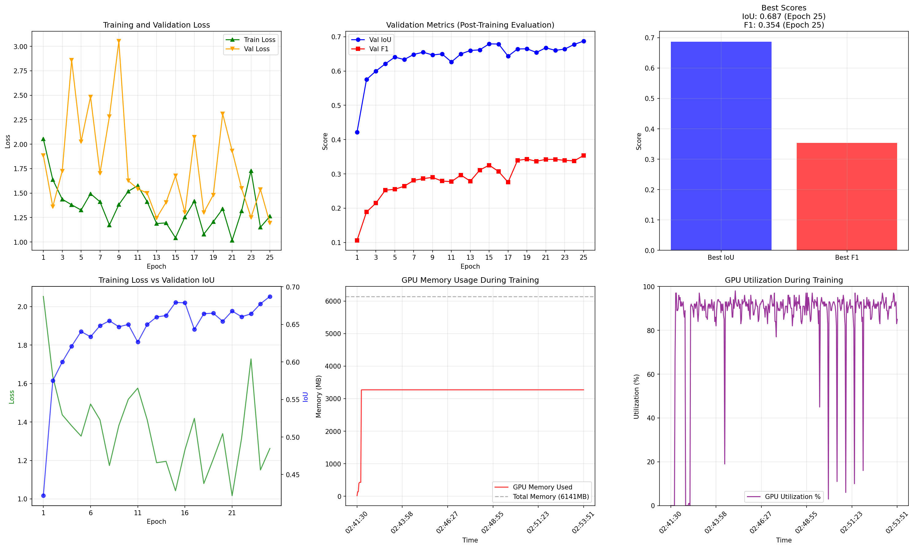
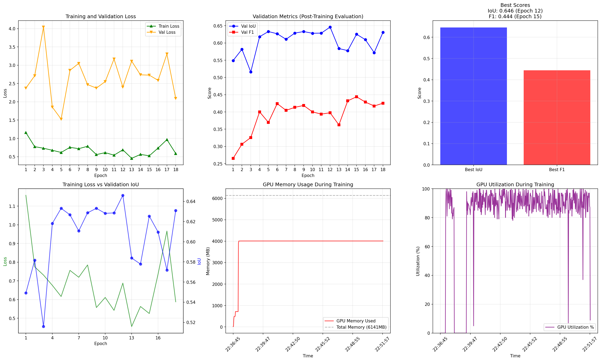
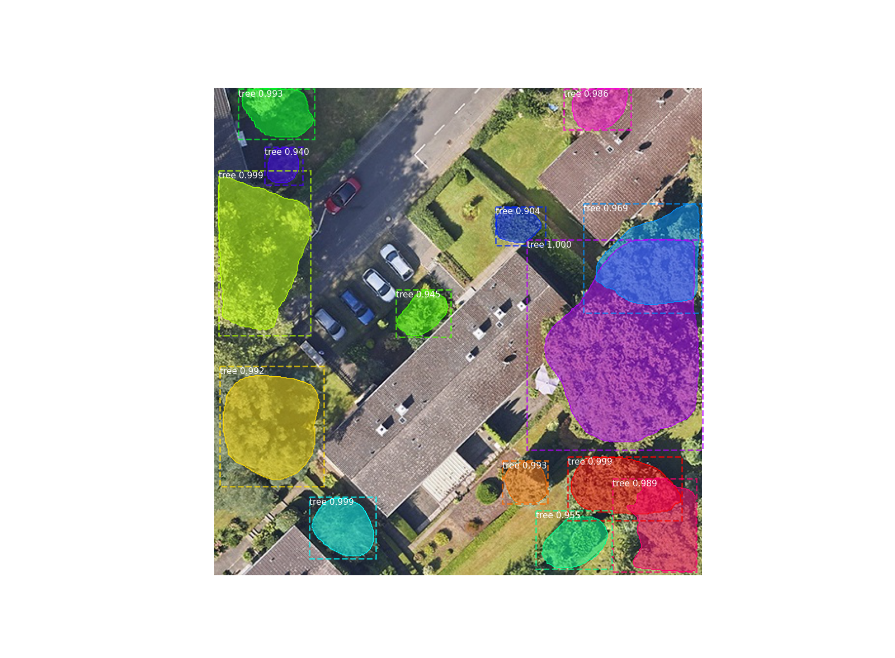

# Shadow Casting Object Segmentation 🌑🖼️

## Overview 🎯

This repository contains code and datasets related to shadow casting object segmentation. The project focuses on detecting and segmenting objects in images affected by shadows, a challenging task in computer vision due to the complex interaction between objects and shadow patterns.

The dataset included follows the YOLO format for object detection training. The segmentation approach aims to improve accuracy in scenarios with significant shadow effects.

## Features ✨

- 📂 Dataset prepared in YOLO format for shadow-affected object segmentation.
- 🛠️ Scripts and models for training and inference.
- 🔧 Tools for preprocessing and annotation support.

## Authors ✍️

- [Sai Mukkundan](mailto:sai.ramamoorthy@smail.inf.h-brs.de) – [📧 Email](mailto:sai.ramamoorthy@smail.inf.h-brs.de)
- [Shrikar Nakhye](https://www.linkedin.com/in/shrikar-n-053262188/) – [📧 Email](mailto:shrikar.nakhye@smail.inf.h-brs.de)

####  Aerial Segmentation Using U-Net: Please refer the [Prithvi Vision Repo](https://github.com/ItsShriks/PrithviVision)

# Aerial Segmentation with Mask R-CNN

This project provides an implementation of Mask R-CNN for instance segmentation of trees in aerial imagery. It is built upon the Matterport Mask R-CNN implementation and includes scripts for training, evaluation, and visualization.

## Environment Setup

### 1. Create Conda Environment

Create a conda environment with the required dependencies using the provided environment file:

```bash
conda env create -f ../Essentials/maskrcnn_gpu.yml
```

### 2. Activate Environment

```bash
conda activate maskrcnn_gpu
```

### 3. Install Matterport Mask R-CNN

Follow the official Matterport Mask R-CNN setup process:

```bash
# Install the mrcnn package
cd mrcnn_lib
python3 setup.py install

# Download pre-trained COCO weights (required for transfer learning)
wget https://github.com/matterport/Mask_RCNN/releases/download/v2.0/mask_rcnn_coco.h5
```

**Note**: Ensure you have CUDA-compatible GPU drivers installed for optimal performance with the nvidia-tensorflow package.

## Scripts

### 1. `aerial_segmentation.py`

The main production script for training and testing Mask R-CNN models on aerial tree imagery. This enhanced implementation includes advanced memory management, comprehensive logging, and post-training evaluation features.

**Key Features:**
- **Post-Training Evaluation**: Validates all saved epochs after training to conserve GPU memory
- **Advanced Logging**: Separates stdout/stderr into `training.log` and `training_error.log`
- **GPU Monitoring**: Real-time GPU memory usage tracking with CSV output
- **Signal Handlers**: Graceful cleanup on interruption to prevent GPU memory leaks
- **Optimized Config**: Tuned hyperparameters for aerial tree segmentation

**Training Command:**
```bash
python3 samples/aerial_segmentation.py --command train --dataset /path/to/yolo_dataset --weights coco --logs /path/to/logs
```

**Inference Command:**
```bash
python3 samples/aerial_segmentation.py --command test --dataset /path/to/yolo_dataset --weights /path/to/trained_weights.h5 --image /path/to/test_image.jpg
```

### 2. `eval_ap.py`

Evaluation script that computes Average Precision (AP) metrics on dataset subsets using trained models. Provides detailed per-image analysis and supports overlay visualization.

**Key Features:**
- **AP Computation**: Uses COCO-style evaluation metrics with configurable IoU thresholds
- **CSV Output**: Detailed per-image results with ground truth vs prediction counts
- **Overlay Generation**: Optional visualization of predictions vs ground truth
- **Batch Processing**: Efficient evaluation on validation/test sets

**Evaluation Command:**
```bash
python3 samples/eval_ap.py --dataset /path/to/yolo_dataset --subset valid --weights /path/to/weights.h5 --output results.csv --iou 0.5
```

**With Overlays:**
```bash
python3 samples/eval_ap.py --dataset /path/to/yolo_dataset --weights /path/to/weights.h5 --save_overlays /path/to/output_dir --limit 50
```

### 3. `tree_segmentation.py`

Simplified baseline script that provides basic training and inference functionality. This script served as the foundation for the enhanced `aerial_segmentation.py` implementation.

**Key Features:**
- **Simple Interface**: Basic train/test commands without advanced features
- **GPU Memory Limiting**: Optional 4GB GPU memory constraint
- **Overlay Generation**: Basic prediction visualization with contours
- **Configuration Display**: Shows active model parameters during execution

**Training Command:**
```bash
python3 samples/tree_segmentation.py --command train --dataset /path/to/yolo_dataset --weights coco --epochs 30
```

**Inference Command:**
```bash
python3 samples/tree_segmentation.py --command test --image /path/to/image.jpg --weights /path/to/weights.h5 --save_overlay --output /path/to/output.jpg
```

## Results

The model was trained on a custom dataset of aerial images with YOLO-style polygon annotations using two different backbone architectures. The training produced comprehensive metrics showing the model's learning progress over time.The below charts displays the training and validation losses, as well as the F1-score and IoU, providing a comprehensive view of the model's performance.

### ResNet-50 Backbone (Recommended)



**Performance Summary:**
- **Validation IoU**: 0.687
- **Validation F1-Score**: 0.354  
- **GPU Memory Usage**: 3.27 GB
- **Training Time**: 29.5 seconds/epoch
- **Final Training Loss**: 1.26

### ResNet-101 Backbone (Higher Accuracy)



**Performance Summary:**
- **Higher model capacity** with deeper backbone architecture
- **Increased GPU memory requirements** (~5.2 GB)
- **Longer training time** but potentially better feature extraction
- **Suitable for high-end GPUs** with sufficient memory

### Inference Results



The above images demonstrate the model's inference capabilities on aerial tree imagery, showing detected instances with segmentation masks and bounding boxes. Both backbone architectures provide robust tree detection and segmentation performance, with ResNet-50 offering better computational efficiency and ResNet-101 providing higher model accuracy and classification.

## Getting Started

### Dataset Preparation

Ensure your dataset follows the YOLO format structure:
```
dataset/
├── train/
│   ├── images/
│   └── labels/
└── valid/
    ├── images/
    └── labels/
```

**Important Note on Dataset Processing:**

The Mask R-CNN scripts (`aerial_segmentation.py` and `tree_segmentation.py`) include built-in preprocessing that automatically converts YOLO-format polygon annotations to Mask R-CNN format during runtime. This conversion process:

- Reads YOLO-style `.txt` label files with normalized polygon coordinates
- Converts polygon coordinates to pixel coordinates based on image dimensions
- Generates binary masks for each object instance using `cv2.fillPoly()`
- Creates the required mask arrays and class IDs for Mask R-CNN training

**Key Differences from U-Net:**
- **U-Net**: Requires pre-processed masks saved as separate image files
- **Mask R-CNN**: Processes YOLO annotations on-the-fly during training/inference
- **Storage**: No intermediate mask files are saved to disk, reducing storage requirements
- **Flexibility**: Supports multiple instances per image with individual masks per object

This runtime conversion approach allows for efficient memory usage and eliminates the need to store large mask files, unlike the U-Net implementation which requires pre-generated mask images.

### Training

#### 1. Basic Training (Recommended)

Start training with pre-trained COCO weights:

```bash
python3 samples/aerial_segmentation.py --command train --dataset /path/to/yolo_dataset --weights coco
```

#### 2. Training with Custom Options

```bash
python3 samples/aerial_segmentation.py --command train \
    --dataset /path/to/yolo_dataset \
    --weights coco \
    --logs /custom/logs/directory \
    --epochs 25
```

#### 3. Resume Training from Checkpoint

```bash
python3 samples/aerial_segmentation.py --command train \
    --dataset /path/to/yolo_dataset \
    --weights /path/to/checkpoint.h5 \
    --logs /logs/directory
```

**Training Options:**
- `--dataset`: Path to YOLO-format dataset directory (required)
- `--weights`: Pre-trained weights - use `coco` for COCO weights or path to `.h5` file
- `--logs`: Directory to save training logs and model checkpoints (default: `../logs`)
- `--epochs`: Number of training epochs (default: 25)
- `--layers`: Layers to train - `heads` (default) or `all`

**Training Features:**
- **Automatic GPU Memory Management**: Optimized memory allocation to prevent OOM errors
- **Progressive Evaluation**: Post-training validation on all saved epochs
- **Comprehensive Logging**: Separate log files for training and error messages
- **Real-time Monitoring**: GPU memory usage tracking throughout training
- **Signal Handling**: Safe cleanup on interruption (Ctrl+C)

### Inference

#### 1. Single Image Inference

```bash
python3 samples/aerial_segmentation.py --command test \
    --weights /path/to/trained_model.h5 \
    --image /path/to/test_image.jpg
```

#### 2. Batch Inference with Custom Settings

```bash
python3 samples/aerial_segmentation.py --command test \
    --weights /path/to/trained_model.h5 \
    --image /path/to/test_image.jpg \
    --min_confidence 0.7 \
    --save_overlay \
    --output /path/to/output_directory
```

**Inference Options:**
- `--weights`: Path to trained model weights (`.h5` file) (required)
- `--image`: Path to input image for inference (required for test mode)
- `--min_confidence`: Detection confidence threshold (default: 0.8)
- `--save_overlay`: Save visualization with detected masks
- `--output`: Custom output path for results

### Evaluation

#### 1. Standard Evaluation

Compute Average Precision (AP) on validation set:

```bash
python3 samples/eval_ap.py --dataset /path/to/yolo_dataset \
    --subset valid \
    --weights /path/to/trained_model.h5 \
    --output evaluation_results.csv
```

#### 2. Detailed Evaluation with Visualizations

```bash
python3 samples/eval_ap.py --dataset /path/to/yolo_dataset \
    --subset valid \
    --weights /path/to/trained_model.h5 \
    --output detailed_results.csv \
    --save_overlays /path/to/overlay_output \
    --iou 0.5 \
    --limit 100 \
    --min_confidence 0.7
```

**Evaluation Options:**
- `--dataset`: Path to YOLO-format dataset (required)
- `--subset`: Dataset subset to evaluate - `train` or `valid` (default: `valid`)
- `--weights`: Path to trained model weights (required)
- `--output`: CSV file for detailed results (default: `eval_results.csv`)
- `--save_overlays`: Directory to save prediction overlay images
- `--iou`: IoU threshold for AP calculation (default: 0.5)
- `--limit`: Maximum number of images to evaluate
- `--min_confidence`: Override model's detection confidence threshold
- `--logs`: Custom logs directory (default: `../logs`)

**Evaluation Outputs:**
- **CSV Results**: Per-image metrics including ground truth count, predictions, and AP scores
- **Overlay Images**: Visual comparison of predictions vs ground truth (if `--save_overlays` specified)
- **Summary Statistics**: Mean AP across all evaluated images

### Alternative Baseline Script

For simpler training without advanced features, use the baseline script:

```bash
# Training
python3 samples/tree_segmentation.py --command train \
    --dataset /path/to/yolo_dataset \
    --weights coco \
    --layers heads

# Inference with overlay
python3 samples/tree_segmentation.py --command test \
    --image /path/to/image.jpg \
    --weights /path/to/model.h5 \
    --save_overlay \
    --output /path/to/result.jpg
```
